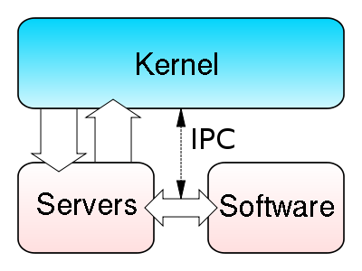
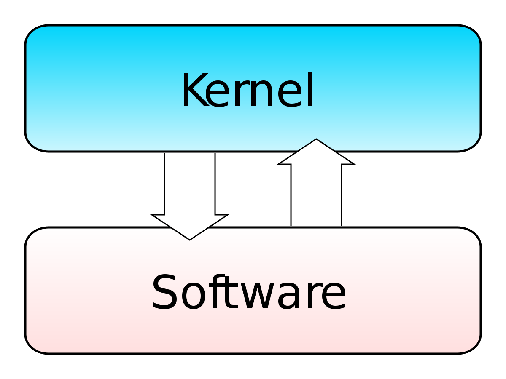
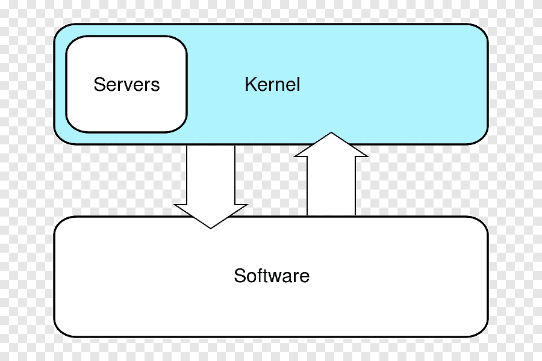
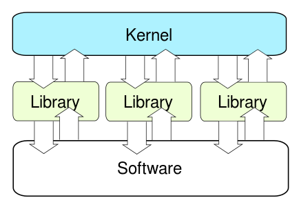

***201901772 - Daniel Reginaldo Dubón Rodríguez***

# 👨‍💻Tipos de Kernel y sus diferencias

## ✔️ Tipos

### 1. ***Microkernel o micronúcleo:***

Se basa en ofrecer las funciones básicas de cada dispositivo, administrando aquello que tenga CPU, memoria e IPC. Son más compactos que otro tipo de núcleos, por lo que brindan un conjunto reducido de abstracciones básicas del hardware, lo cual brinda beneficios en cuanto a portabilidad, seguridad y su capacidad para adaptarse.

En resumen son núcleos de pequeño tamaño que fueron compilados sólo con las necesidades más básicas del sistema operativo.

### 2. ***Kernel Monolítico:***

Se trata de un gran nucleo informático, que engloba todos los servicios del sistema. Es de tipo no modular y puede alcanzar un mayor rendimiento que un microkernel. Los kernel monolíticos deben incorporar códigos que operen con varios dispositivos, canales de interrupción y demás operadores de hardware, por lo que, para realizarle modificaciones se requiere de la compilación del núcleo y reiniciar el sistema.

***Kernel del sistema Linux:*** el núcleo de Linux es monolítico, por lo que los programas tienen mayor acceso al hardware y mantienen mejor comunicación entre sí, pero tiene dificultades a nivel de seguridad. Utiliza los llamados módulos de Kernel para agregar o quitar características del núcleo en el momento en que se necesite.

### 3. ***Kernel Híbrido:***

La combinación del kernel monolítico y el microkernel se denomina kernel híbrido. En este caso, el kernel grande se hace más compacto y modulable. Otras partes del kernel pueden cargarse dinámicamente por lo que los controladores pueden ser prevolcados (detenidos momentáneamente por actividades más importantes) bajo ciertas condiciones. Esta habilidad fue agregada para gestionar correctamente interrupciones de hardware, y para mejorar el soporte de Multiprocesamiento Simétrico.

Una característica especial con que cuenta el núcleo híbrido es que incluyen código extra con el objetivo de mejorar el rendimiento.

***La Mayoría de los Sistemas Operativos modernos contienen un Núcleo Híbrido***

### 4. ***Exokernel:***

Este kernel su estructura es innovadora ya que se encuentra de manera vertical. Los núcleos son pequeños y su desarrollo tiene fines investigativos. En un exokernel la toma de decisiones está a cargo de los programas, para hacer uso de los recursos del harware en ciertas bibliotecas. El Kernel se limita a evitar errores en los permisos de hardware y eludir conflictos.

 La idea subyacente es permitir que el desarrollador tome todas las decisiones relativas al rendimiento del hardware. Los exonúcleos son extremadamente pequeños, ya que limitan expresamente su funcionalidad a la protección y el multiplexado de los recursos.

## ✔️ Diferencias

### Principales diferencias entre los kernels más comúnes
| Tipo de Kernel   | Estructura                               | Diseño                                  | Ventajas                                                         | Desventajas                                                                                     |
|------------------|-----------------------------------------|----------------------------------------|------------------------------------------------------------------|-------------------------------------------------------------------------------------------------|
| Monolítico       | Un solo espacio de direcciones y contexto | Funcionalidades integradas en un núcleo | Acceso rápido a funciones del kernel.                             | Mayor tamaño y complejidad del código.                                                         |
| Microkernel      | Núcleo mínimo con servicios esenciales   | Servicios no esenciales fuera del núcleo | Mayor seguridad y facilidad de mantenimiento.                     | Comunicación entre procesos puede ser más lenta.                                               |
| Híbrido          | Combinación de monolítico y microkernel | Funcionalidades críticas en el núcleo    | Equilibrio entre eficiencia y modularidad.                        | Mayor complejidad del diseño en comparación con enfoques más simples.                          |
| Exokernel        | Exposición directa de recursos de hardware | Aplicaciones controlan recursos        | Mayor flexibilidad y optimización de recursos para aplicaciones. | Desarrollo de aplicaciones más complejo y potencialmente menos seguro si no se maneja bien. |

# 👨‍💻User vs Kernel Mode

### - ***User Mode:***
Es uno de los modos de operación principales en un sistema operativo moderno que utiliza el concepto de protección de memoria. En este modo los programas y las aplicaciones se ejecutan con privilegios limitados y restringidos. Esto significa que ciertas instrucciones y recursos del hardware no están disponibles directamente para el programa en ejecución.

Cuando un programa se inicia en un sistema operativo, digamos ventanas, luego inicia el programa en modo de usuario. Y cuando un programa en modo de usuario solicita ejecutarse, Windows crea un espacio de direcciones virtual y de proceso (para ese proceso). Modo de usuario los programas son menos privilegiados que las aplicaciones en modo de usuario y no se les permite acceder directamente a los recursos del sistema.

### - ***Kernel Mode:***

Es el modo de operación principal en un sistema operativo moderno que utiliza el concepto de protección de memoria. En este modo el núcleo o kernel del sistema operativo se ejecuta con privilegios máximos y acceso completo a los recursos del harware. Esto significa que tiene la capacidad de realizar operaciones críticas y acceder a áreas de memoria restringidas que no están disponibles para las aplicaciones en modo usuario.

##  🥊Vrs

| CRITERIOS |KERNEL MODE | USER MODE |
|:-------------------:|---|---|
| Principales diferencias |En el modo kernel, el programa tiene acceso directo y sin restricciones a los recursos del sistema.|En modo de usuario, el programa de aplicación se ejecuta y se inicia.|
|Interrupciones|En el modo Kernel, todo el sistema operativo podría disminuir si se produce una interrupción.|En el modo de usuario, un solo proceso falla si ocurre una interrupción.|
|Modos|En el modo kernel, todos los procesos comparten un solo espacio de dirección virtual.|En el modo de usuario, todos los procesos obtienen espacio de dirección virtual separado.|
|Nivel de privilegio|En el modo kernel, las aplicaciones tienen más privilegios en comparación con el modo de usuario.|Mientras que en el modo de usuario, las aplicaciones tienen menos privilegios.|
|Restricciones|Como el modo kernel puede acceder tanto a los programas de usuario como a los programas de kernel, no hay restricciones.|Si bien el modo de usuario necesita acceder a los programas del kernel ya que no puede acceder directamente a ellos.|
|Valor de bit de modo|El bit de modo del kernel mode es 0.|Mientras el bit de modo de usuario es 1.|
|Referencias de memoria|Es capaz de hacer referencia a ambas áreas de memoria.|Solo puede hacer referencias a la memoria asignada para el modo de usuario.|
|Choque del sistema|Un bloqueo del sistema en modo kernel es severo y hace las cosas más complicadas.|En el modo de usuario, se puede recuperar un bloqueo del sistema simplemente reanudando la sesión.|
|Funcionalidad|El modo kernel puede referirse a cualquier bloque de memoria en el sistema y también puede dirigir la CPU para la ejecución de una instrucción, lo que lo convierte en un modo muy potente y significativo.|El modo de usuario es un modo de visualización estándar y típico, lo que implica que la información no se puede ejecutar por sí sola o hacer referencia a ningún bloque de memoria. Necesita una interfaz de protocolo de aplicación (API) para lograr estas cosas.|