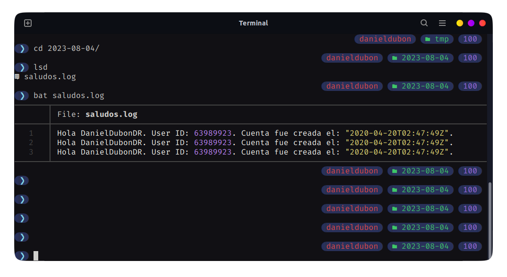
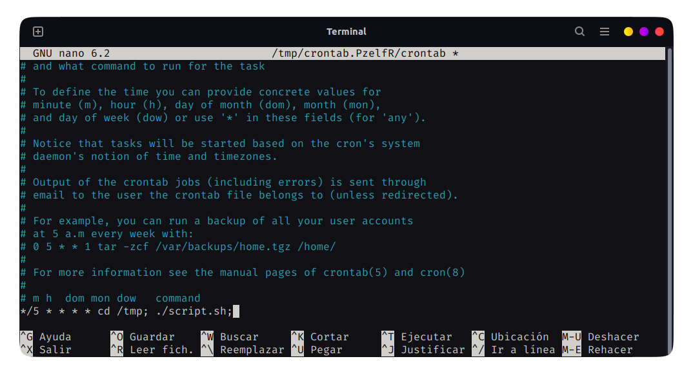
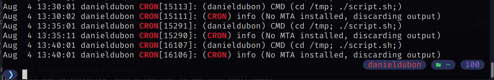

***201901772 - Daniel Reginaldo Dubón Rodríguez***

# 👨‍💻Scripting Bash Shell

## Descripción

Crear un script de Bash que realice Io siguiente:

- Leer variable GITHUB_USER
- Consultar Ia URL https://api.github.com/users/ concatenando eI valor de Ia variable GITHUB_USER al final.
- Imprimir el mensaje
  - "Hola <github_user>. User ID: id. Cuenta fue creada el: <created_at>."
- Crear un log file en /tmp/fecha/saludos.log con la salida del mensaje anterior. Donde
fecha corresponde a la fecha del dia de ejecución del script
- Crear un cronjob para que el script se ejecute cada 5 minutos

## ✅ Script
```bash
#!/bin/bash

# Pide el nombre de usuario de GitHub y lo almacena en la variable GITHUB_USER
# OJO: Pare efectos del cronjob comente las sigueintes dos lineas y descomente la tercera
echo "Introduce tu nombre de usuario de GitHub:"
read GITHUB_USER
# GITHUB_USER="DanielDubonDR"

# Realilza la petición GET a la API de GitHub para obtener los datos del usuario
RES=$(curl -s https://api.github.com/users/$GITHUB_USER)

# Almacena en variables los datos del usuario
ID=$(echo $RES | jq '.id')
CREATED_AT=$(echo $RES | jq '.created_at')

# Imprime un mensaje con los datos del usuario
MESSAGE="Hola $GITHUB_USER. User ID: $ID. Cuenta fue creada el: $CREATED_AT."
echo $MESSAGE

# Almacena en la variable FECHA la fecha actual
FECHA=$(date +%Y-%m-%d)

# Crea el directorio
mkdir -p "/tmp/$FECHA"

# Guarda el mensaje en el archivo saludos.log
echo $MESSAGE >> "/tmp/$FECHA/saludos.log"
```

## ✅ Log file
<div align="center"></div>

## ✅ Cronjob
El script se encuentra en la ruta ``/tmp/script.sh``

### Configuración
<div align="center"></div>

### Logs de CRON
<div align="center"></div>