***201901772 - Daniel Reginaldo Dubón Rodríguez***

# 👨‍💻 Parte 1: Gestion de Usuarios

## 1.1 Creación de Usuarios:


- ### Comando utilizado para crear usuarios
```bash
# Donde N representa el numero de usuario a crear, ej usuario1, usuario2, usuarioN
sudo adduser usuarioN
```

- ### Creación del `usuario1`
<div align="center">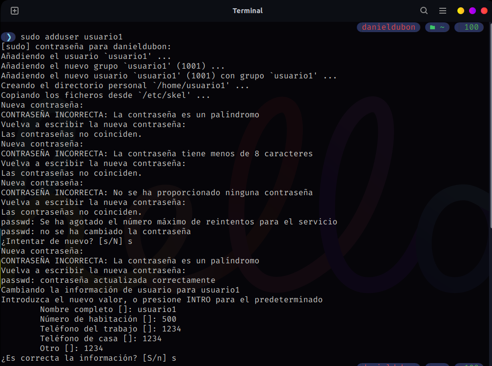</div>

- ### Creación del `usuario2`
<div align="center">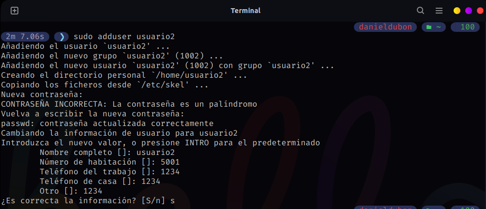</div>

- ### Creación del `usuario3`
<div align="center">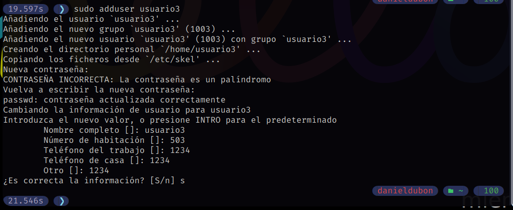</div>


## 1.2 Asignaición de contraseñas:


- ### Comando utilizado para asignar contraseña a los usuarios
```bash
# Donde N representa el numero de usuario a crear, ej usuario1, usuario2, usuarioN
sudo passwd usuarioN
```

- ### Asignacion de contraseña a cada uno de los usuarios
<div align="center">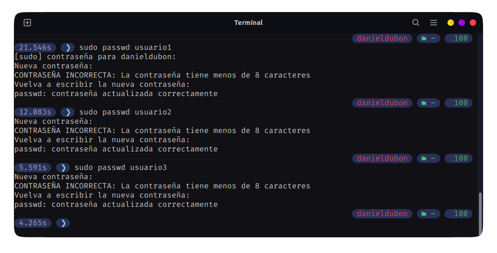</div>

## 1.3 Información de usuarios:


- ### Comando utilizado para ver la informacion del `usuario1`
```bash
id usuario1
```

- ### Informacion del `usuario1`
<div align="center">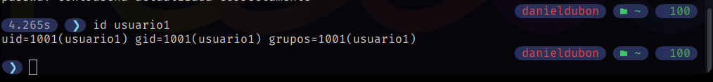</div>


## 1.4 Eliminacion de usuarios:


- ### Comando para eliminar el usuario3 conservando su directorio principal
```bash
sudo userdel usuario3
```

- ### Eliminacion del `usuario3`
<div align="center"></div>

# 👨‍👩‍👧‍👦 Parte 2: Gestion de Grupos

## 2.1 Creación de Grupos:


- ### Comando utilizado para crear grupos
```bash
# Donde N representa el numero de grupo a crear, ej grupo1, grupo2, grupoN
sudo addgroup grupoN
```

- ### Creación del `grupo1` y `grupo2`
<div align="center">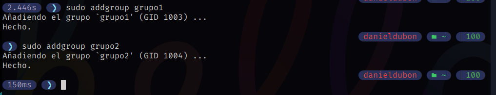</div>

## 2.2 Agregar Usuarios a Grupos:


- ### Comando utilizado para agregar usuarios a grupos
```bash
# Donde N representa el numero de usuario o grupo, ej usuario1,grupo1
sudo usermod -aG grupoN usuarioN
```

- ### Agregación de `usuario1` a `grupo1` y `usuario2` a `grupo2`
<div align="center"></div>

## 2.3 Verificar Membresia:


- ### Comando utilizado validar la membresia
```bash
# Donde N representa el numero de usuario a crear, ej usuario1, usuario2, usuarioN
groups usuarioN
```

- ### Verficicación de grupos del `usuario1` y `usuario2`
<div align="center">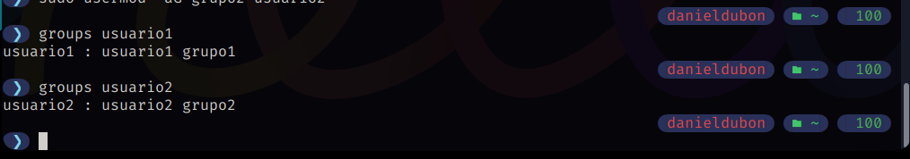</div>

## 2.4 Eliminar Grupo:

- ### Comando utilizado para eliminar grupos
```bash
# Donde N representa el numero de grupo a crear, ej grupo1, grupo2, grupoN
sudo delgroup grupoN
```

- ### Eliminacion del `grupo2`
<div align="center"></div>

# 🪪 Parte 3: Gestion de Permisos

## 3.1 Creación de Grupos:


### Creación de Archivos y Directorios

- ***Como `usuario1`, crea un archivo llamado `archivo1.txt` en su directorio principal y escribe algo en él***

```bash
# Logueo del usuario1
su usuario1
# Cambio a directorio principal del usuario1
cd ~
#Comprobacion del directorio principal
pwd
#Creación del arhcivo
echo "Hola Mundo desde usuario1" > archivo1.txt
```

<div align="center">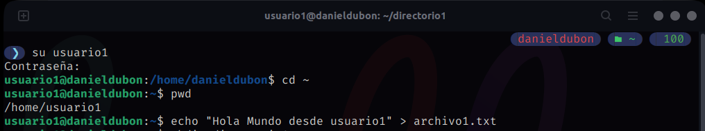</div>

- ***Crea un directorio llamado `directorio1` y dentro de ese directorio, un archivo llamado `archivo2.txt`***

```bash
# Creación del directorio1
mkdir directorio1
# Cambio a directorio al directorio1
cd directorio1
#Creación del arhcivo
echo "Directorio creado usuario1" > archivo2.txt
```

<div align="center">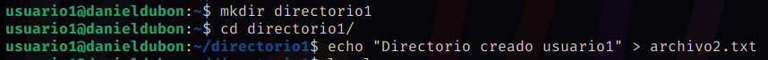</div>

## 3.2 Verificar Permisos:
```bash
ls -l
ls -ld
```
- ### Permisos del `archivo1` y `directorio principal`

<div align="center">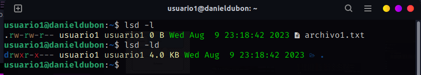</div>

- ### Permisos del `archivo2` y `directorio1`
<div align="center"></div>

## 3.3 Modificar Permisos usando `chmod` con Modo Numérico:

- ### Calculo de los permisos
<div align="center">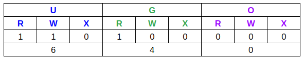</div>

```bash
chmod 640 archivo1.txt
```
<div align="center"></div>

## 3.4 Modificar Permisos usando `chmod` con Modo Simbólico:

```bash
chmod u+x archivo2.txt
```
<div align="center">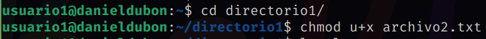</div>

## 3.5 Cambiar el Grupo Propietario:

- ### Cambia el grupo propietario de `archivo2.txt` a `grupo1`
```bash
chgrp grupo1 archivo2.txt
```
<div align="center">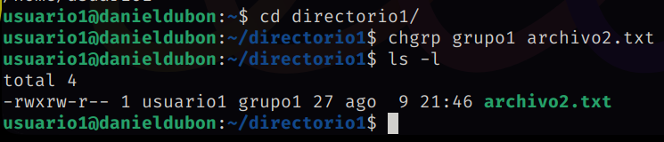</div>

## 3.6 Configurar Permisos de Directorio:

Cambia los permisos del `directorio1` para que sólo el propietario pueda entrar (permisos `rwx`), el grupo pueda listar contenidos pero no entrar (permisos `r--`), y otros no puedan hacer nada.

- ### Calculo de los permisos
<div align="center">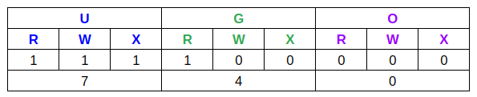</div>

```bash
chmod 740 archivo1.txt
```
<div align="center">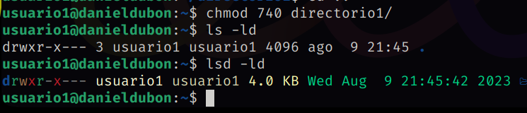</div>

## 3.7 Comprobación de Acceso:

- ### Acceso al `archivo1.txt` desde el `usuario2`

<div align="center">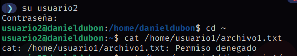</div>

- ### Acceso al `directorio1/archivo2.txt` desde el `usuario2`

<div align="center"></div>

## 3.8 Verificación Final:
```bash
ls -l
ls -ld
```
- ### Permisos del `archivo1` y `directorio principal`
<div align="center">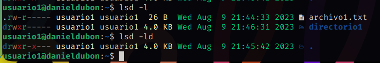</div>

- ### Permisos del `archivo2` y `directorio1`
<div align="center">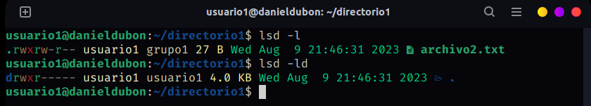</div>

# Reflexión

### ¿Por qué es importante gestionar correctamente los usuarios y permisos en un sistema operativo?

Una adecuada gestión de usuarios y permisos es esencial para garantizar la seguridad, la privacidad y el funcionamiento eficiente de un sistema operativo y sus recursos en entornos personales y empresariales.

### ¿Qué otros comandos o técnicas conocen para gestionar permisos en Linux?

- `chmod`: Cambia permisos de archivos y directorios en modo numérico (modo octal) o simbólico (u, g, o +, -, =, r, w, x).

- `chown`: Cambia el propietario y grupo de un archivo o directorio.

- `chgrp`: Cambia el grupo de un archivo o directorio.

- `umask`: Define los permisos predeterminados para archivos nuevos.

- `setfacl`: Configura permisos avanzados utilizando listas de control de acceso (ACL).

- `getfacl`: Muestra permisos ACL para archivos y directorios.

- `adduser`: Agrega un nuevo usuario.

- `deluser`: Elimina un usuario.

- `addgroup`: Agrega un nuevo grupo.

- `delgroup`: Elimina un grupo.

- `usermod`: Modifica las propiedades de un usuario.

- `groupmod`: Modifica las propiedades de un grupo.