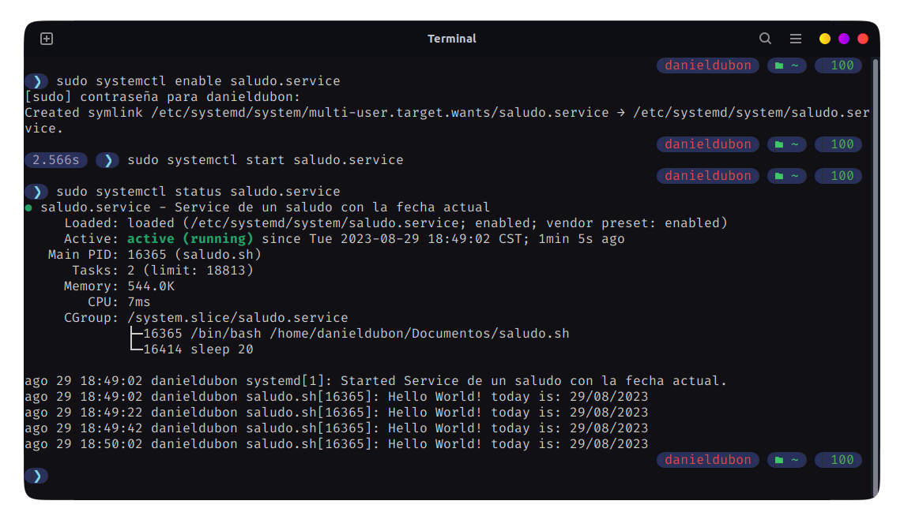
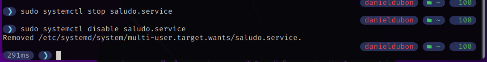

***201901772 - Daniel Reginaldo Dubón Rodríguez***

# 👨‍💻 System Unit

## Descripción

Crear un systemd unit de tipo servicio para ejecutar un script imprima un saludo y la fecha actual.

## 📝 Proceso de creación

### 1. Crear el script encargado de imprimir el saludo y fecha actual

```bash
#!/bin/bash

# Script que imprime un mensaje cada 20 segundos
while true
do
    echo "Hello World! today is: $(date +"%d/%m/%Y")"
    sleep 20
done
```

### 2. Darle permisos de ejecución al archivo

Asegurarse de posicionarse en la carpeta donde se encuentra el script

```bash
chmod +x saludo.sh
```

### 3. Crear el service `saludo.service` en la ruta `/etc/systemd/system`

```bash
cd /etc/systemd/system
sudo touch saludo.service
```

Al archivo porporcinarle las configuraciones al servicio.

En `ExecStart` proporcionar la ruta donde se encuentra el script del saludo

```bash
[Unit]
Description=Service de un saludo con la fecha actual

[Service]
Type=simple
ExecStart=/home/danieldubon/Documentos/saludo.sh

[Install]
WantedBy=multi-user.target
```
### 4. Habilitar el servicio

```bash
sudo systemctl enable saludo.service
```

### 5. Iniciar el servicio

```bash
sudo systemctl start saludo.service
```

### 6. Ver es estado del servicio
```bash
sudo systemctl status saludo.service
```
<div align="center"></div>

## Deshabilitar el servicio

### 1. Deterner el servicio

```bash
sudo systemctl stop saludo.service
```

### 2. Deshabilitar el servicio

```bash
sudo systemctl disable saludo.service
```

<div align="center"></div>